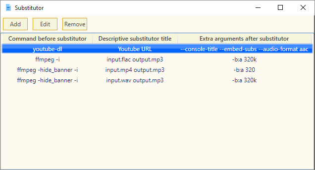

# Substitutor
Store multiple CMD code snippets, run snippets by substituting the code you want. Avoid repetition &amp; be lazy!

## Requirements
- .NET framework 4.5+

## Installation
- Just download and unzip the latest portable archive from here: [Releases](https://github.com/flawiddsouza/Substitutor/releases)
- And you're ready to roll!

## Usage
Adding a snippet

Using a snippet
